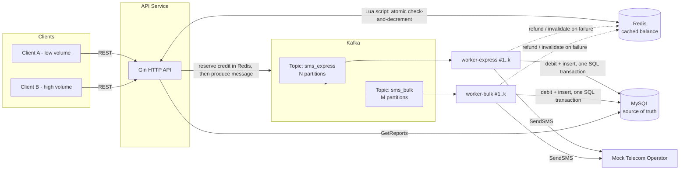
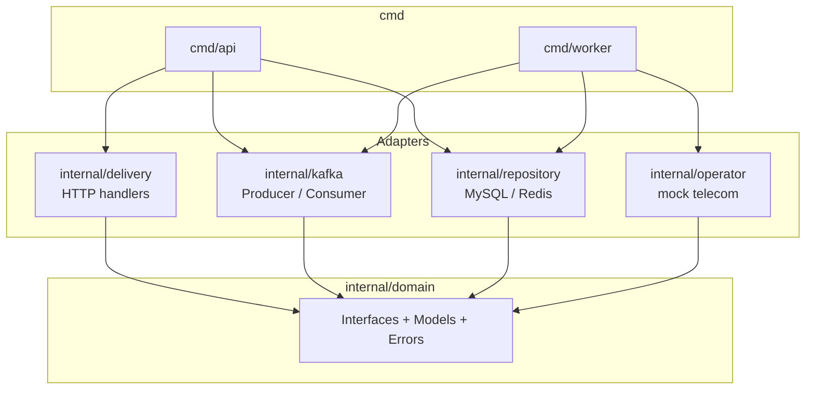
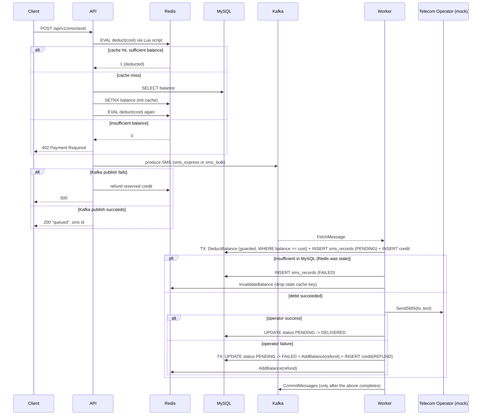
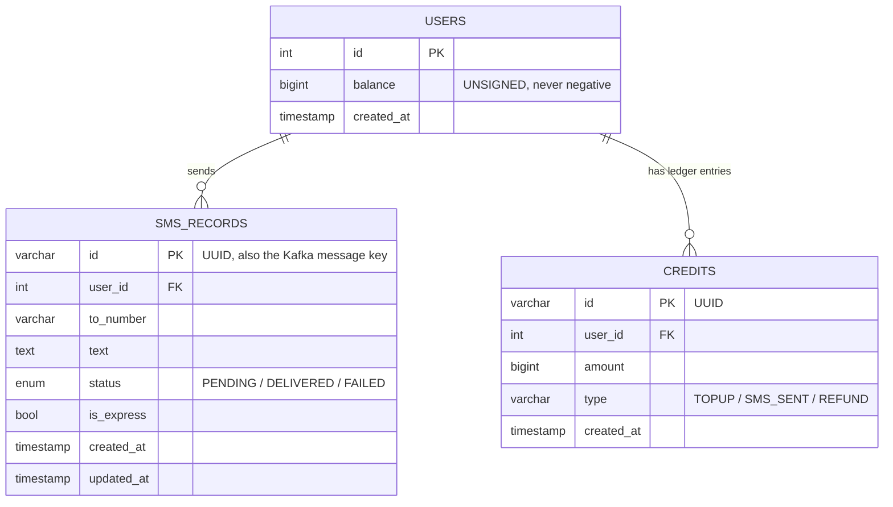

# SMS Gateway — Architecture

This document describes the system design of the SMS Gateway built for the
ArvanCloud software developer challenge: a REST API that lets any number of
clients top up a balance, send SMS (bulk or express), and fetch delivery
reports, at a scale of ~100M messages/day with highly uneven traffic across
clients.

## 1. Goals driving the design

| Requirement from the spec | Design response |
|---|---|
| ~100M SMS/day, unpredictable spikes | API never talks to the telecom directly; it only validates + queues. Kafka absorbs bursts, workers drain at their own pace. |
| Traffic is very uneven across clients (a few clients send huge volumes, most send very little) | Kafka messages are **not** partitioned by `user_id`. A `RoundRobin` balancer spreads every client's messages evenly across all partitions, so one noisy client can't starve a worker while others sit idle. |
| Express SMS (e.g. OTP codes) need a delivery-time guarantee | Express and bulk traffic live on **separate Kafka topics**, each with their own partitions and worker pool, so a flood of bulk marketing SMS can never delay an OTP. |
| A client must be able to use 100% of their balance, and must never be able to send after it hits zero | Two-layer balance guard: Redis for a sub-millisecond pre-check, MySQL as the transactional source of truth that can never go negative. |
| Clients must be able to fetch delivery reports | Every SMS is persisted with a status (`PENDING` / `DELIVERED` / `FAILED`) and is queryable per user. |
| REST only, no UI, no auth | Plain JSON HTTP API (`gin`), no session/auth layer. |
| 7-day budget | Go, because concurrency (goroutines/channels) maps directly onto "one goroutine per Kafka partition," which is the whole scaling story. |

## 2. High-level component diagram

Two binaries share the same domain/repository code (`cmd/api`, `cmd/worker`):

- **API** (`cmd/api`) — stateless, horizontally scalable. Owns `POST /users/charge`,
  `POST /sms/send`, `GET /users/:id/report`.
- **Worker** (`cmd/worker`) — one process, run in two deployment flavors
  (`WORKER_TYPE=express` / `bulk`), each consuming its own topic. This is the
  component that actually talks to MySQL for debits and to the (mock) telecom
  operator.

Both binaries only depend on `internal/domain` interfaces (`UserRepository`,
`SMSRepository`, `CreditRepository`, `CacheRepository`, `MessageProducer`,
`SMSOperator`, `TransactionManager`) — this is the Clean/Hexagonal split:

`internal/delivery` (the HTTP layer) and `internal/kafka` (the consumer) never
import `database/sql` or a MySQL driver directly — they only see the
interfaces in `internal/domain`. This is what makes both fully unit-testable
with in-memory fakes (see `internal/delivery/http_test.go` and
`internal/kafka/consumer_test.go`), with no real database or broker needed.

## 3. Request flow: sending an SMS

Key point: the API's Redis check is only a **fast-path reservation**, never
the final word. The worker's MySQL transaction is the actual charge, guarded
by `UPDATE users SET balance = balance - ? WHERE id = ? AND balance >= ?`. If
Redis and MySQL ever disagree (Redis restarted, evicted a key, or was never
populated), MySQL wins and the worker invalidates the Redis key so the next
request reloads the true balance. This is what makes "balance can never go
negative" and "no free SMS" hold even under cache failures, not just under
the happy path.

## 4. Idempotency and at-least-once delivery

Kafka consumers in this system are **at-least-once**: a crash between
"process message" and "commit offset" causes the same message to be
redelivered. The design handles every redelivery case explicitly instead of
assuming it won't happen:

- **SMS id is the Kafka message key and the MySQL primary key.** A redelivered
  "debit + insert" transaction hits a duplicate-key error (`ErrDuplicateRecord`),
  which the worker treats as "already handled" rather than double-charging.
- **Crash between debit and insert:** on redelivery, the debit fails (already
  done) but the SMS row doesn't exist yet — the worker detects this and
  resumes from "send to operator" without charging again.
- **Crash between insert and status finalize:** `UpdateStatusFrom(id, PENDING, DELIVERED/FAILED)`
  is a conditional `UPDATE ... WHERE status = 'PENDING'`. A second delivery
  attempt sees the row is no longer `PENDING` and treats the transition as a
  no-op instead of re-sending or re-refunding.
- **A message is never `continue`-skipped on a transient error.** Because
  `kafka-go` commits are cumulative (committing offset N implicitly commits
  every offset before it), skipping message N would silently drop it forever,
  along with the user's paid credit. Instead, `processMessage` retries in
  place with backoff until it succeeds or the process is shutting down; on
  shutdown, the offset is deliberately left uncommitted so the next consumer
  instance picks the message back up.

## 5. Avoiding InnoDB deadlocks under concurrent workers

The worker's "debit + insert SMS + insert credit" unit of work (see section 3)
touches the same user row from three statements in one transaction. `sms_records`
and `credits` both carry a foreign key to `users`, so MySQL's InnoDB engine
needs *some* lock on the user row to satisfy each `INSERT`, and a stronger
lock to run the `balance` update. If two workers happened to process messages
for the **same** user at the same time and issued their statements in
different orders, InnoDB can deadlock (Error 1213): worker A holds a Shared
lock (from an `INSERT`'s FK check) while waiting to escalate to Exclusive for
the balance update, and worker B is doing the mirror image — each waiting on
the other.

The fix is write ordering, not a different isolation level: every transaction
in this codebase runs `UPDATE users SET balance = balance ± ?` **first** —
`DeductBalance` before `SMSRepository.Create`/`CreditRepository.Create` in
`internal/kafka/consumer.go`'s debit path, and the same order on the refund
path. Acquiring the Exclusive lock up front means a second worker touching the
same user simply queues behind the first one instead of racing it for lock
escalation, which removes the deadlock without weakening consistency.

## 6. Scaling to ~100M messages/day with uneven clients

- 100M/day ≈ 1,160 msg/sec average, with real spikes far above that — Kafka
  is the shock absorber between the bursty API traffic and the
  rate-limited-by-nature worker/telecom side.
- Partitioning uses `kafka.RoundRobin`, **not** a hash of `user_id`. If
  partitioning were keyed by client, one client sending 50,000 SMS in a burst
  would pin all of them to a single partition/consumer, while eight other
  workers sat idle — exactly the "unequal distribution" problem called out in
  the spec. Round-robin spreads every client's messages across all partitions,
  so throughput scales with total partition/worker count regardless of which
  client is generating the load.
- Express vs. bulk are physically separate topics (`sms_express`,
  `sms_bulk`), each independently scalable via `KAFKA_PARTITIONS_EXPRESS` /
  `KAFKA_PARTITIONS_BULK` and `WORKER_EXPRESS_REPLICAS` / `WORKER_BULK_REPLICAS`
  in `deployments/.env`. A backlog of bulk marketing traffic can never delay
  an express OTP, because they're different consumer groups on different
  topics entirely.
- Scaling model is "one goroutine per partition, one partition per worker
  slot" — no internal goroutine pools inside a single consumer. This was a
  deliberate choice: committing offsets concurrently from multiple goroutines
  inside one consumer risks committing offset N+1 before offset N is durably
  processed, which can silently lose a message on a crash. Instead, throughput
  is scaled the same way Kafka is designed to be scaled: add partitions, add
  worker replicas.
- MySQL connection pools are sized per role and documented in `.env`
  (`API_DATABASE_MAX_OPEN_CONNECTIONS`, `WORKER_DATABASE_MAX_OPEN_CONNECTIONS`)
  with the constraint `api_conns + (express_replicas + bulk_replicas) * worker_conns < MYSQL_MAX_CONNECTIONS`
  spelled out right next to the values, so scaling replica counts doesn't
  silently exhaust MySQL's connection limit.
- `sms_records(user_id, created_at DESC)` is a composite index, so
  `GetReports` stays O(log n) instead of a filesort even once a user has
  millions of rows.

## 7. Data model

`balance` is `BIGINT UNSIGNED` and MySQL runs with `sql-mode=STRICT_ALL_TABLES`,
so the database engine itself rejects any operation that would drive it
negative — this is a second, storage-level backstop underneath the
application-level `WHERE balance >= cost` guard. `credits` is an audit trail
(top-up / charge / refund) rather than something the business logic reads
back from, which keeps the balance check itself a single indexed column read.

## 8. Deployment topology

`deployments/docker-compose.yml` runs: `mysql`, `redis`, `zookeeper` + `kafka`,
a one-shot `init-kafka` job that creates `sms_express`/`sms_bulk` with their
configured partition counts, one `api` service, and two independently-scaled
worker services (`worker-express`, `worker-bulk`) built from the same image
via `WORKER_TYPE`. All tunables (ports, replica counts, partition counts,
connection-pool sizes, `SMS_COST`) live in `deployments/.env`
(`deployments/.env.example` is the checked-in template; `.env` itself is
git-ignored since it holds credentials).

## 9. Known simplifications (in scope for this challenge)

- The mock operator (`internal/operator/mock.go`) simulates 10–100ms latency
  and a 90% success rate; a real integration would replace `SMSOperator` with
  an adapter that calls the actual telecom API — no other layer would need to
  change, since the worker only depends on the `SMSOperator` interface.
- No authentication/authorization layer, no multi-page/concatenated SMS
  handling, and a single flat price regardless of language — all per the
  challenge's explicit assumptions.
- Kafka replication factor is 1 in the local compose stack (single broker);
  a production deployment would run a multi-broker cluster with a replication
  factor ≥ 3 for durability, and remove `KAFKA_AUTO_CREATE_TOPICS_ENABLE=false`'s
  single point of setup (`init-kafka`) in favor of Terraform/GitOps-managed
  topics.
